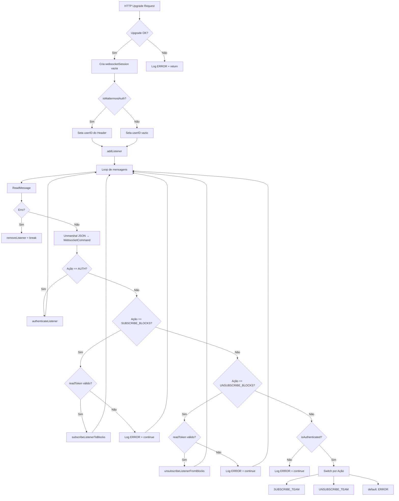
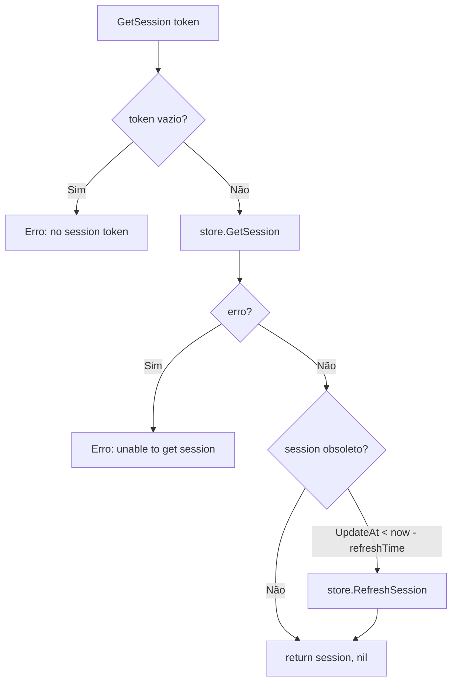
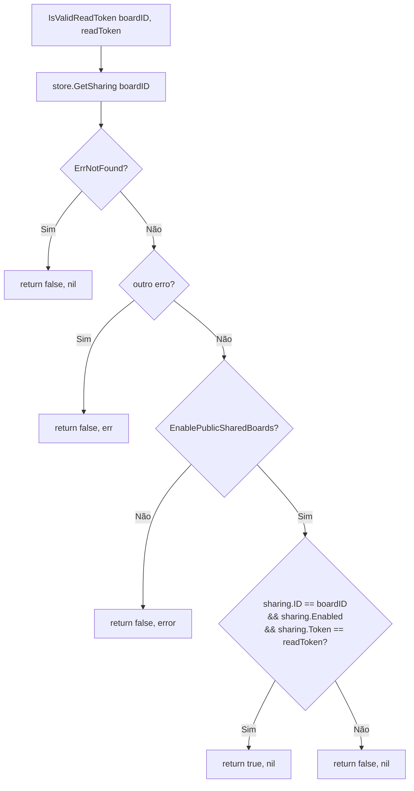
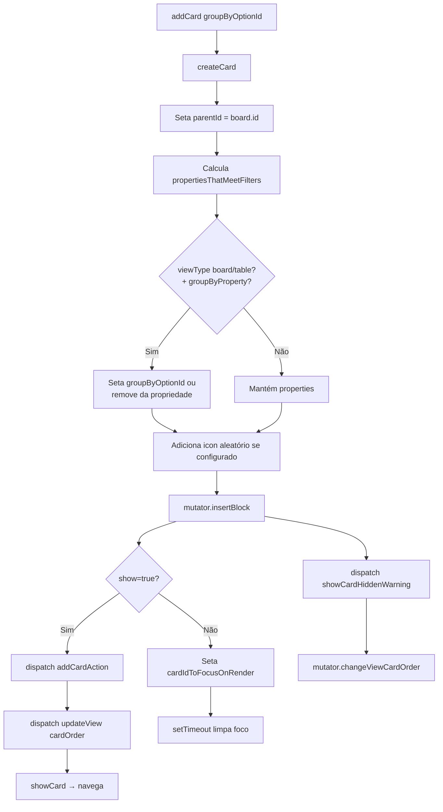

# Code Analysis — nexo

> Gerado pelo Archaeologist em 2026-05-12
> 🟢 CONFIRMADO | 🟡 INFERIDO | 🔴 LACUNA

---

## Módulo: `server/ws` — WebSocket

### Visão Geral

Módulo de comunicação WebSocket bidirecional. Suporta dois modos de operação:

1. **Standalone Server** (`server.go`): servidor WebSocket nativo usando `gorilla/websocket`
2. **Plugin Adapter** (`plugin_adapter.go`): adaptador para execução como plugin do Mattermost, utilizando a API de WebSocket do Mattermost para clusterização

### Fluxo de Controle

#### 1. Handshake e Conexão (`server.go:handleWebSocket`)



#### 2. Broadcast de Mudanças

O servidor possui múltiplos métodos `Broadcast*` que notificam listeners sobre mudanças:

| Método | Gatilho | Público |
|--------|---------|---------|
| `BroadcastBlockChange` | Bloco criado/alterado | Membros do board + inscritos no bloco |
| `BroadcastBlockDelete` | Bloco removido | Mesmo que BlockChange |
| `BroadcastBoardChange` | Board alterado | Membros do board |
| `BroadcastBoardDelete` | Board removido | Membros do board |
| `BroadcastMemberChange` | Membro adicionado/alterado | Membros do board |
| `BroadcastMemberDelete` | Membro removido | Membros do board (incluindo removido) |
| `BroadcastConfigChange` | Config alterada | Todos os listeners |
| `BroadcastCategoryChange` | Categoria alterada | Usuário específico |
| `BroadcastCategoryBoardChange` | Board associado a categoria | Usuário específico |
| `BroadcastSubscriptionChange` | Inscrição alterada | **Não implementado** (standalone) |
| `BroadcastCardLimitTimestampChange` | Limite de cards alterado | **Não implementado** (standalone) |
| `BroadcastCategoryReorder` | Reordenar categorias | Usuário específico |
| `BroadcastCategoryBoardsReorder` | Reordenar boards na categoria | Usuário específico |

#### 3. Plugin Adapter — Clusterização

No modo plugin, as mensagens são propagadas para outros nós do cluster via `HandleClusterEvent` e `sendMessageToCluster`. O `ClusterMessage` contém:

- `TeamID`, `BoardID`, `UserID` — para roteamento
- `Payload` — dados da mensagem
- `EnsureUsers` — usuários que devem obrigatoriamente receber

O `PluginAdapter` não implementa inscrição/desinscrição de blocos individuais via WebSocket (só funciona em modo standalone com read tokens).

### Estruturas de Dados

#### Server (Standalone)
- **`Server`**: contém `upgrader`, `listeners` (map[*websocketSession]bool), `listenersByTeam`, `listenersByBlock`, mutex, `auth`, `singleUserToken`, `isMattermostAuth`, `logger`, `store`
- **`websocketSession`**: `conn`, `userID`, `mu`, `teams []string`, `blocks []string`

#### PluginAdapter
- **`PluginAdapter`**: `api servicesAPI`, `auth`, `staleThreshold`, `store`, `logger`, `listeners`, `listenersByUserID`, `listenersByTeam`, `listenersByBlock`
- **`PluginAdapterClient`**: `inactiveAt int64`, `webConnID`, `userID`, `teams []string`, `blocks []string`, `mu`

#### Mensagens (em `common.go`)
- **`UpdateCategoryMessage`**: action, teamId, category, blockCategories
- **`UpdateBlockMsg`**: action, teamId, block
- **`UpdateBoardMsg`**: action, teamId, board
- **`UpdateMemberMsg`**: action, teamId, member
- **`UpdateSubscription`**: action, subscription
- **`UpdateClientConfig`**: action, clientconfig
- **`UpdateCardLimitTimestamp`**: action, timestamp
- **`WebsocketCommand`**: action, teamId, token, readToken, blockIds
- **`CategoryReorderMessage`**: action, categoryOrder, teamId
- **`CategoryBoardReorderMessage`**: action, CategoryId, BoardOrder, teamId

#### Cluster
- **`ClusterMessage`**: TeamID, BoardID, UserID, Payload, EnsureUsers

### Constantes e Enums

```go
websocketActionAuth                     = "AUTH"
websocketActionSubscribeTeam            = "SUBSCRIBE_TEAM"
websocketActionUnsubscribeTeam          = "UNSUBSCRIBE_TEAM"
websocketActionSubscribeBlocks          = "SUBSCRIBE_BLOCKS"
websocketActionUnsubscribeBlocks        = "UNSUBSCRIBE_BLOCKS"
websocketActionUpdateBoard              = "UPDATE_BOARD"
websocketActionUpdateMember             = "UPDATE_MEMBER"
websocketActionDeleteMember             = "DELETE_MEMBER"
websocketActionUpdateBlock              = "UPDATE_BLOCK"
websocketActionUpdateConfig             = "UPDATE_CLIENT_CONFIG"
websocketActionUpdateCategory           = "UPDATE_CATEGORY"
websocketActionUpdateCategoryBoard      = "UPDATE_BOARD_CATEGORY"
websocketActionUpdateSubscription       = "UPDATE_SUBSCRIPTION"
websocketActionUpdateCardLimitTimestamp  = "UPDATE_CARD_LIMIT_TIMESTAMP"
websocketActionReorderCategories        = "REORDER_CATEGORIES"
websocketActionReorderCategoryBoards    = "REORDER_CATEGORY_BOARDS"
```

### Store Interface

```go
type Store interface {
    GetBlock(blockID string) (*model.Block, error)
    GetMembersForBoard(boardID string) ([]*model.BoardMember, error)
}
```

### PluginAdapterInterface

```go
type PluginAdapterInterface interface {
    Adapter
    OnWebSocketConnect(webConnID, userID string)
    OnWebSocketDisconnect(webConnID, userID string)
    WebSocketMessageHasBeenPosted(webConnID, userID string, req *mmModel.WebSocketRequest)
    BroadcastConfigChange(clientConfig model.ClientConfig)
    BroadcastBlockChange(teamID string, block *model.Block)
    BroadcastBlockDelete(teamID, blockID, parentID string)
    BroadcastSubscriptionChange(teamID string, subscription *model.Subscription)
    BroadcastCardLimitTimestampChange(cardLimitTimestamp int64)
    HandleClusterEvent(ev mmModel.PluginClusterEvent)
}
```

---

## Módulo: `server/auth` — Autenticação

### Visão Geral

Módulo de autenticação responsável por gerenciar sessões de usuário e validar tokens de acesso. Fornece três serviços principais: validação de sessão, validação de read tokens (compartilhamento público) e verificação de acesso a teams.

### Fluxo de Controle

#### 1. GetSession (`auth.go:32`)



#### 2. IsValidReadToken (`auth.go:48`)



#### 3. DoesUserHaveTeamAccess (`auth.go:68`)

Delega para `permissions.HasPermissionToTeam(userID, teamID, model.PermissionViewTeam)`.

### Interfaces

```go
type AuthInterface interface {
    GetSession(token string) (*model.Session, error)
    IsValidReadToken(boardID string, readToken string) (bool, error)
    DoesUserHaveTeamAccess(userID string, teamID string) bool
}
```

### Estruturas

**`Auth`**: `config *config.Configuration`, `store store.Store`, `permissions permissions.PermissionsService`

### Dependências

- `config.Configuration` — lê `SessionExpireTime`, `SessionRefreshTime`, `EnablePublicSharedBoards`
- `store.Store` — acesso a sessões e sharing records
- `permissions.PermissionsService` — verificação de permissões RBAC

### Escala de Confiança

| Item | Confiança |
|------|-----------|
| Estrutura do Auth | 🟢 CONFIRMADO |
| Fluxo GetSession com refresh automático | 🟢 CONFIRMADO |
| Validação de read tokens com sharing público | 🟢 CONFIRMADO |
| Delegação de team access para permissions service | 🟢 CONFIRMADO |

---

## Módulo: `webapp/src/components` — Componentes React

### Visão Geral

Módulo de componentes React para a interface web. Contém ~92 entradas entre componentes e subpastas. Organizado em views de layout (Board, Table, Calendar, Gallery) e componentes reutilizáveis (Sidebar, CardDialog, FlashMessages, etc.).

### Estrutura de Componentes

#### Layout Principal

```
Workspace → CenterContent
  ├── Sidebar
  ├── BoardTemplateSelector
  ├── CenterPanel (renderiza view ativa)
  │   ├── TopBar
  │   ├── ViewTitle
  │   ├── ViewHeader
  │   ├── ShareBoardButton/ShareBoardLoginButton
  │   ├── Kanban (board)
  │   ├── Table
  │   ├── CalendarFullView
  │   ├── Gallery
  │   ├── CardLimitNotification
  │   └── CardDialog (modal via RootPortal)
  │       ├── CardDetail
  │       ├── CardActionsMenu
  │       └── ConfirmationDialogBox
  └── GuestNoBoards
```

#### 4 Views de Visualização

| View | Componente Principal | Descrição |
|------|---------------------|-----------|
| Board (Kanban) | `kanban/kanban.tsx` | Quadro kanban com colunas por propriedade de agrupamento |
| Table | `table/table.tsx` | Visualização em tabela com colunas, agrupamento e redimensionamento |
| Calendar | `calendar/` | Visualização em calendário com datas como propriedade |
| Gallery | `gallery/gallery.tsx` | Visualização em galeria de cards |

#### Submódulos de Componentes

| Subpasta | Componentes | Função |
|----------|-------------|--------|
| `cardDetail/` | CardDetail, CardDetailContents, CardDetailProperties, CommentsList, Comment, Attachment | Visualização e edição detalhada de cards |
| `sidebar/` | Sidebar, SidebarBoardItem, SidebarCategory, SidebarSettingsMenu, SidebarUserMenu | Navegação lateral |
| `blocksEditor/` | BlocksEditor, Editor, BlockContent, RootInput | Editor de conteúdo baseado em blocos |
| `kanban/` | Kanban, KanbanCard, KanbanColumn, KanbanColumnHeader | Quadro kanban |
| `table/` | Table, TableRow, TableHeader, TableGroup, HorizontalGrip | Visualização tabela |
| `gallery/` | Gallery, GalleryCard | Visualização galeria |
| `calendar/` | CalendarFullView | Visualização calendário |
| `calculations/` | Cálculos agregados por coluna |
| `permissions/` | BoardPermissionGate | Controle de acesso por permissão |
| `onboardingTour/` | Tours de onboarding (Board, Card, ShareBoard) |
| `shareBoard/` | ShareBoardButton, ShareBoardDialog | Compartilhamento de boards |
| `searchDialog/` | Busca de conteúdo |
| `content/` | ContentElement | Elementos de conteúdo renderizáveis |
| `flashMessages/` | FlashMessages, sendFlashMessage | Notificações toast |

### Fluxos de Controle

#### 1. Criação de Card (`centerPanel.tsx:174`)



#### 2. WebSocket Client Init (`withWebSockets.tsx:20`)

```mermaid
flowchart TD
    A[WithWebSockets mount] --> B{wsClient já conectado?}
    B -->|Sim| C[return (não faz nada)]
    B -->|Não| D{É legacy route?}
    D -->|Sim| E[return (desabilita WS)]
    D -->|Não| F[Busca token: localStorage<br/>ou query param r]
    F --> G{token existe?}
    G -->|Sim| H[wsClient.authenticate token]
    G -->|Não| I[pula autenticação]
    H --> J[wsClient.open]
    I --> J
```

#### 3. Card Detail Dialog (`cardDialog.tsx:49`)

Gerencia visualização/edição de card em modal com:
- Carregamento de card, contents, comments, attachments via Redux selectors
- Ações: delete (com confirmação se card não vazio), make template, attach file
- Upload de attachment com XHR + progress tracking via Redux
- Renderização condicional de template banner, empty state e permission gate

### Estruturas de Dados

#### Props principais

| Interface | Uso |
|-----------|-----|
| `Workspace Props` | `readonly: boolean` |
| `CenterPanel Props` | `board`, `cards`, `activeView`, `views`, `groupByProperty`, `dateDisplayProperty`, `readonly`, `shownCardId`, `showCard`, `hiddenCardsCount` |
| `CardDialog Props` | `board`, `activeView`, `views`, `cards`, `cardId`, `onClose`, `showCard`, `readonly` |

### Estado Global (Redux)

Consultas padrão via `useAppSelector`:
- `getCurrentBoard`, `getCurrentView`, `getCurrentViewCardsSortedFilteredAndGrouped`
- `getMe`, `getBoardUsers`, `getClientConfig`
- `getCard`, `getCardContents`, `getCardComments`, `getCardAttachments`
- `getOnboardingTourStarted/Step/Category`

### Hotkeys (centerPanel)

| Tecla | Ação |
|-------|------|
| `Esc` | Limpa seleção de cards |
| `Ctrl+D` | Duplica cards selecionados |
| `Del/Backspace` | Deleta cards selecionados |

### Escala de Confiança

| Item | Confiança |
|------|-----------|
| Layout principal com 4 views (Board, Table, Calendar, Gallery) | 🟢 CONFIRMADO |
| CardDialog com CRUD de cards, comments, attachments | 🟢 CONFIRMADO |
| Inicialização de WebSocket com autenticação por token | 🟢 CONFIRMADO |
| Seleção múltipla de cards com Shift/Cmd+Shift+Click | 🟢 CONFIRMADO |
| Criação de card com template e properties que atendem filtros | 🟢 CONFIRMADO |
| Sistema de permissões via BoardPermissionGate | 🟢 CONFIRMADO |
| Tours de onboarding com persistência em UserConfig | 🟢 CONFIRMADO |
| Upload de attachment com progresso via XHR | 🟢 CONFIRMADO |

---

## Módulo: `webapp/src/store` — Redux Store

### Visão Geral

Store central da aplicação construída com **Redux Toolkit** (`@reduxjs/toolkit`). Contém **16 slices** gerenciando o estado global da aplicação. A store é tipada com `RootState` e `AppDispatch` inferidos automaticamente.

### Slices

| Slice | Arquivo | Estado Principal | Descrição |
|-------|---------|-----------------|-----------|
| `users` | `users.ts` | `me`, `boardUsers`, `loggedIn`, `blockSubscriptions`, `myConfig` | Usuário logado, usuários do board, preferências |
| `teams` | `teams.ts` | `current`, `currentId`, `allTeams` | Time atual e lista de times |
| `channels` | `channels.ts` | `current` | Canal atual (integração Mattermost) |
| `language` | `language.ts` | `value` | Idioma atual (`'en'` padrão) |
| `boards` | `boards.ts` | `current`, `boards`, `templates`, `membersInBoards`, `myBoardMemberships` | Boards, templates e membros |
| `views` | `views.ts` | `current`, `views` | Views (Board, Table, Gallery, Calendar) |
| `cards` | `cards.ts` | `current`, `cards`, `templates`, `limitTimestamp`, `cardHiddenWarning` | Cards e templates de cards |
| `contents` | `contents.ts` | `contents`, `contentsByCard` | Conteúdos de blocos aninhados por card |
| `comments` | `comments.ts` | `comments`, `commentsByCard` | Comentários por card |
| `searchText` | `searchText.ts` | `value` | Texto de busca atual |
| `globalError` | `globalError.ts` | `value` | Erro global da aplicação |
| `clientConfig` | `clientConfig.ts` | `value` | Configuração do cliente (telemetry, feature flags) |
| `sidebar` | `sidebar.ts` | `categoryAttributes`, `hiddenBoardIDs` | Categorias da sidebar e boards ocultos |
| `limits` | `limits.ts` | `limits` | Limites cloud (cards, views) |
| `attachments` | `attachments.ts` | `attachments`, `attachmentsByCard` | Anexos com progresso de upload |
| `globalTemplates` | `globalTemplates.ts` | `value` | Templates globais do sistema |

### Ações Assíncronas (Thunks)

| Thunk | Efeito | Gatilho |
|-------|--------|---------|
| `initialLoad` | Carrega dados iniciais (me, config, team, boards, memberships, templates, limits) | App startup |
| `initialReadOnlyLoad` | Carrega board + blocks para modo somente leitura | Board público via read token |
| `loadBoardData` | Carrega todos os blocks de um board | Navegação para board |
| `loadBoards` | Recarrega lista de boards | Refresh |
| `loadMyBoardsMemberships` | Recarrega memberships do usuário | Refresh |
| `fetchMe` | Busca dados do usuário logado + config | Login |
| `fetchTeams` | Busca lista de times | Team selection |
| `fetchBoardMembers` | Busca membros + dados de usuários do board | Board open |
| `fetchClientConfig` | Busca config do cliente | App startup |
| `fetchSidebarCategories` | Busca categorias da sidebar | Team selection |
| `fetchGlobalTemplates` | Busca templates globais | Template selector |
| `fetchUserBlockSubscriptions` | Busca inscrições (placeholder — retorna `[]`) | Subscriptions init |
| `refreshCards` | Atualiza cards limitados que expiraram | Card limit threshold |
| `updateMembersEnsuringBoardsAndUsers` | Atualiza memberships + carrega boards/usuários novos | Membership change |

### Fluxo de Card Sorting (`cards.ts:220`)

```mermaid
flowchart TD
    A[sortCards cards, lastCommentByCard, board, activeView, usersById] --> B{sortOptions.length > 0?}
    B -->|Não| C[Manual sort via cardOrder da view]
    C --> D[titleOrCreatedOrder como fallback]
    B -->|Sim| E[Para cada sortOption:]
    E --> F{propertyId == __title?}
    F -->|Sim| G[título > criado (untitled no final)]
    F -->|Não| H[Busca template da property]
    H --> I{template type?}
    I -->|number / date| J[Empty values no final, compara Number]
    I -->|createdBy| K[username do criador]
    I -->|updatedBy| L[username do modificador]
    I -->|createdTime| M[createAt]
    I -->|updatedTime| N[max(updateAt, lastComment.updateAt)]
    I -->|select / multiSelect| O[Busca option.value pelo ID]
    I -->|multiPerson| P[username mapeado por usersById]
    I -->|others| Q[localeCompare]
    I -->|Empate| R[titleOrCreatedOrder]
```

### Board Members Update (`boards.ts:102`)

Atualiza `membersInBoards` e `myBoardMemberships`: se todas as permissões são `false` → membro removido.

### Sidebar Category Reorder (`sidebar.ts:136`)

Reordena categorias no array `categoryAttributes` usando um Map de ID → CategoryBoards.

### Escala de Confiança

| Item | Confiança |
|------|-----------|
| 16 slices Redux com estados e reducers | 🟢 CONFIRMADO |
| `initialLoad` com 8 chamadas paralelas | 🟢 CONFIRMADO |
| Card sorting multi-critério com 8+ tipos de propriedade | 🟢 CONFIRMADO |
| Sistema de categorias sidebar com reordenação | 🟢 CONFIRMADO |
| Atualização de membros com permissões schemeAdmin/Editor/Viewer/Commenter | 🟢 CONFIRMADO |
| Limites cloud com card_limit_timestamp | 🟢 CONFIRMADO |
| Upload de attachment com percentual via XHR | 🟢 CONFIRMADO |

---

## Módulo: `webapp/src/blocks` — Modelos de Dados

### Visão Geral

Módulo de tipos e modelos que define a estrutura de dados fundamental do sistema. Baseado em um modelo de **blocos** onde boards, cards, views, comentários e conteúdos são todos subtipos de `Block`.

### Hierarquia de Tipos

```
Block (base — 15 campos)
├── Board (Board + cardProperties, minimumRole, etc.)
├── Card (Block + CardFields: icon, isTemplate, properties, contentOrder)
├── BoardView (Block + BoardViewFields: viewType, sortOptions, filter, cardOrder...)
├── CommentBlock (Block, type fixo 'comment')
├── AttachmentBlock (Block, type fixo 'attachment')
├── ContentBlock (alias para Block)
│   ├── TextBlock, ImageBlock, DividerBlock, CheckboxBlock
│   ├── H1Block, H2Block, H3Block
│   └── Video, Quote, ListItem (via contentBlockTypes)
└── FilterGroup / FilterClause (sistema de filtros recursivo)
```

### PropertyTypeEnum (18 tipos)

`text`, `number`, `select`, `multiSelect`, `date`, `person`, `multiPerson`, `file`, `checkbox`, `url`, `email`, `phone`, `createdTime`, `createdBy`, `updatedTime`, `updatedBy`, `unknown`

### Filter Conditions (14)

`includes`, `notIncludes`, `isEmpty`, `isNotEmpty`, `isSet`, `isNotSet`, `is`, `contains`, `notContains`, `startsWith`, `notStartsWith`, `endsWith`, `notEndsWith`, `isBefore`, `isAfter`

### Patch System (Undo/Redo via Delta)

O módulo implementa um sistema de patches para undo/redo:
- `createPatchesFromBlocks` — gera `[updatePatch, undoPatch]` comparando fields antigos e novos
- `createPatchesFromBoards` — gera patches para board + cardProperties
- `createPatchesFromBoardsAndBlocks` — gera patches combinados
- `smartViewUpdate` — preserva referências de arrays inalterados (evita re-renderização)

### Escala de Confiança

| Item | Confiança |
|------|-----------|
| Sistema de blocos com 8+ tipos | 🟢 CONFIRMADO |
| 18 tipos de propriedade de card | 🟢 CONFIRMADO |
| Patches com undo/redo via delta | 🟢 CONFIRMADO |
| Filtros recursivos (FilterGroup aninhado and/or) | 🟢 CONFIRMADO |
| 14 condições de filtro | 🟢 CONFIRMADO |
| smartViewUpdate: preserva referências | 🟢 CONFIRMADO |
| Board minimumRole com 4 níveis | 🟢 CONFIRMADO |

---

## Módulo: `webapp/src/pages` — Páginas da Aplicação

### Visão Geral

Módulo de páginas da aplicação React. Utiliza React Router v5 para navegação.

### Páginas

| Página | Caminho | Descrição |
|--------|---------|-----------|
| `boardPage` | `boardPage/boardPage.tsx` | Página principal — orquestra todo o workspace |
| `loginPage` | `loginPage.tsx` | Tela de login |
| `registerPage` | `registerPage.tsx` | Tela de registro |
| `changePasswordPage` | `changePasswordPage.tsx` | Tela de alteração de senha |
| `errorPage` | `errorPage.tsx` | Tela de erro global |
| `welcomePage` | `welcome/welcomePage.tsx` | Tela de boas-vindas pós-login |

### BoardPage Componentes Internos

| Subcomponente | Função |
|---------------|--------|
| `BackwardCompatibilityQueryParamsRedirect` | Redireciona URLs antigas para novo formato |
| `TeamToBoardAndViewRedirect` | Redireciona team → board → view |
| `WebsocketConnection` | Mantém conexão WebSocket com o servidor |
| `UndoRedoHotKeys` | Ctrl+Z / Ctrl+Shift+Z global |
| `SetWindowTitleAndIcon` | Atualiza título e favicon |

### Escala de Confiança

| Item | Confiança |
|------|-----------|
| 6 páginas (Board, Login, Register, ChangePassword, Error, Welcome) | 🟢 CONFIRMADO |
| BoardPage com WebSocket, undo/redo, redirecionamentos | 🟢 CONFIRMADO |
| Login/Register com integração ao servidor Go | 🟢 CONFIRMADO |
| Suporte a modo read-only via token público | 🟢 CONFIRMADO |

---

## Módulo: `import/` — Importadores de Dados

### Visão Geral

Conjunto de 6 ferramentas CLI para importar dados de plataformas externas para o formato Focalboard. Todas seguem o mesmo padrão: ler arquivo de entrada → converter para Board + Blocks → serializar como `.boardarchive` (JSONL).

### Importadores

| Plataforma | Arquivo | Formato de Entrada | Funcionalidades |
|------------|---------|-------------------|-----------------|
| **Trello** | `trello/importTrello.ts` | JSON (Trello export) | Lists → Select property, cards, checklists, desc → text block |
| **Jira** | `jira/importJira.ts` | XML (Jira export) | Projects → Boards, issues → cards, XML → Markdown via turndown |
| **Asana** | `asana/importAsana.ts` | JSON (Asana export) | Projects → Boards, tasks → cards, sections → Select, subtasks |
| **Todoist** | `todoist/importTodoist.ts` | JSON (Todoist export) | Projects → Select property, 5 seções padrão, items → cards |
| **Notion** | `notion/importNotion.ts` | CSV + Markdown pasta | CSV rows → cards, .md files → text content |
| **Nextcloud Deck** | `nextcloud-deck/importDeck.ts` | API REST (interativo) | Autenticação via URL/user/pass, seleção interativa de board, stacks, cards, comments |

### Utilitário Compartilhado

**`util/archive.ts`** — `ArchiveUtils.buildBlockArchive(boards, blocks)` gera JSONL com:
- Linha 1: header `{version, date}`
- N linhas: boards serializados
- M linhas: blocks serializados

### Arquitetura Comum

```mermaid
flowchart TD
    A[main CLI] --> B[Parse args: -i input -o output]
    B --> C[Read input file/API]
    C --> D[Convert format → Board + Block[]]
    D --> E[ArchiveUtils.buildBlockArchive]
    E --> F[Write .boardarchive file]
```

### Escala de Confiança

| Item | Confiança |
|------|-----------|
| 6 importadores funcionais (Trello, Jira, Asana, Todoist, Notion, Nextcloud) | 🟢 CONFIRMADO |
| Formato .boardarchive (JSONL) | 🟢 CONFIRMADO |
| Conversão de lists/columns para Select property | 🟢 CONFIRMADO |
| Nextcloud Deck com autenticação interativa | 🟢 CONFIRMADO |
| Jira com conversão XML → Markdown (Turndown) | 🟢 CONFIRMADO |
| Notion com CSV + pasta de arquivos .md | 🟢 CONFIRMADO |

---

## Módulo: Desktop Apps — `mac/`, `win-wpf/`, `linux/`

### Visão Geral

Três aplicações desktop nativas que empacotam o Focalboard como aplicativo standalone. Todas seguem a mesma arquitetura: **servidor Go embutido + webview nativo**.

### Comparativo

| Plataforma | Linguagem | Framework WebView | Entry Point |
|------------|-----------|-------------------|-------------|
| **macOS** | Swift | WKWebView | `Focalboard/AppDelegate.swift` |
| **Windows** | C# (.NET) | WebView2 | `Focalboard/App.xaml.cs` |
| **Linux** | Go | webview/webview | `main.go` |

### Linux (`linux/main.go`)

- Abre servidor Go em porta livre (`getFreePort`)
- Gera token single-user (`"su-" + uuid`)
- Configura SQLite como banco local
- Abre webview nativa apontando para `http://localhost:{port}`
- Serve webapp estático do diretório `pack/`
- Suporte a argumento `--port` e `--root` na linha de comando

### macOS (`mac/Focalboard/AppDelegate.swift`)

- `AppDelegate.swift` gerencia ciclo de vida da app
- `ViewController.swift` contém a WKWebView
- `PortUtils.swift` encontra porta livre
- `CustomWKWebView.swift` com handler de download
- Suporte a arrastar/soltar arquivos
- Preferências: atalho Cmd+Q, Cmd+W

### Windows (`win-wpf/Focalboard/`)

- WPF desktop com `MainWindow.xaml`
- `Webview2Installer.cs` garante que WebView2 runtime está instalado
- `Utils.cs` — utilitários diversos
- Inicializa servidor embutido e navega para `localhost`

### Escala de Confiança

| Item | Confiança |
|------|-----------|
| 3 apps desktop (macOS, Windows, Linux) | 🟢 CONFIRMADO |
| Arquitetura servidor embutido + webview | 🟢 CONFIRMADO |
| Linux com Go + webview/webview + SQLite | 🟢 CONFIRMADO |
| macOS com Swift + WKWebView | 🟢 CONFIRMADO |
| Windows com C# WPF + WebView2 | 🟢 CONFIRMADO |
| Single-user token gerado automaticamente (Linux) | 🟢 CONFIRMADO |
