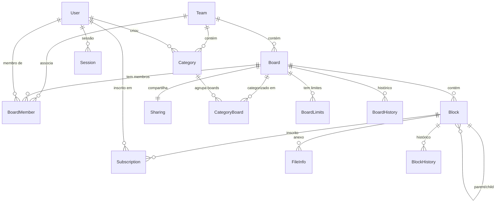

# ERD Completo — nexo

> Gerado pelo Architect em 2026-05-12
> 🟢 CONFIRMADO | 🟡 INFERIDO | 🔴 LACUNA

---

## Diagrama de Entidades e Relacionamentos

## Entidades

### Team

| Campo | Tipo | Descrição |
|-------|------|-----------|
| `id` | `VARCHAR(36)` PK | UUID |
| `title` | `TEXT` | Nome do time |
| `signupToken` | `TEXT` | Token de convite |
| `modifiedBy` | `VARCHAR(36)` | Último modificador |
| `updateAt` | `BIGINT` | Timestamp de modificação |

### Board

| Campo | Tipo | Descrição |
|-------|------|-----------|
| `id` | `VARCHAR(36)` PK | UUID |
| `teamId` | `VARCHAR(36)` FK → Team | Time proprietário |
| `channelId` | `VARCHAR(36)` | Canal Mattermost vinculado |
| `type` | `VARCHAR(1)` | `O` (Open) ou `P` (Private) |
| `title` | `TEXT` | Título |
| `description` | `TEXT` | Descrição |
| `icon` | `TEXT` | Ícone (emoji) |
| `showDescription` | `BOOLEAN` | Mostrar descrição |
| `isTemplate` | `BOOLEAN` | É template |
| `templateVersion` | `INT` | Versão do template |
| `minimumRole` | `VARCHAR(20)` | `viewer`, `commenter`, `editor`, `admin`, `""` |
| `createAt` | `BIGINT` | Timestamp de criação |
| `updateAt` | `BIGINT` | Timestamp de modificação |
| `deleteAt` | `BIGINT` | Timestamp de deleção (soft-delete) |

### Block (Card / View / Comment / Content)

| Campo | Tipo | Descrição |
|-------|------|-----------|
| `id` | `VARCHAR(36)` PK | UUID |
| `boardId` | `VARCHAR(36)` FK → Board | Board pai |
| `parentId` | `VARCHAR(36)` FK → Block (self) | Bloco pai |
| `createdBy` | `VARCHAR(36)` FK → User | Criador |
| `modifiedBy` | `VARCHAR(36)` FK → User | Modificador |
| `type` | `VARCHAR(20)` | `board`, `view`, `card`, `comment`, `text`, `image`, etc. |
| `title` | `TEXT` | Título |
| `fields` | `JSON` | Campos específicos do tipo |
| `schema` | `INT` | Versão do schema (default 1) |
| `createAt` | `BIGINT` | Timestamp de criação |
| `updateAt` | `BIGINT` | Timestamp de modificação |
| `deleteAt` | `BIGINT` | Timestamp de deleção (soft-delete) |

### User

| Campo | Tipo | Descrição |
|-------|------|-----------|
| `id` | `VARCHAR(36)` PK | UUID |
| `username` | `TEXT` | Nome de usuário |
| `email` | `TEXT` | Email |
| `password` | `TEXT` | Hash da senha |
| `createAt` | `BIGINT` | Timestamp de criação |
| `updateAt` | `BIGINT` | Timestamp de modificação |
| `deleteAt` | `BIGINT` | Timestamp de deleção |

### Session

| Campo | Tipo | Descrição |
|-------|------|-----------|
| `id` | `VARCHAR(36)` PK | UUID |
| `token` | `VARCHAR(255)` | Token de sessão |
| `userId` | `VARCHAR(36)` FK → User | Usuário |
| `createAt` | `BIGINT` | Timestamp de criação |
| `updateAt` | `BIGINT` | Timestamp de renovação |
| `expiresAt` | `BIGINT` | Timestamp de expiração |

### BoardMember

| Campo | Tipo | Descrição |
|-------|------|-----------|
| `boardId` | `VARCHAR(36)` FK → Board | Board |
| `userId` | `VARCHAR(36)` FK → User | Usuário |
| `minimumRole` | `VARCHAR(20)` | Role mínima |
| `schemeAdmin` | `BOOLEAN` | Admin |
| `schemeEditor` | `BOOLEAN` | Editor |
| `schemeCommenter` | `BOOLEAN` | Commenter |
| `schemeViewer` | `BOOLEAN` | Viewer |
| `synthetic` | `BOOLEAN` | Não persistido |

### Category

| Campo | Tipo | Descrição |
|-------|------|-----------|
| `id` | `VARCHAR(36)` PK | UUID |
| `name` | `TEXT` | Nome |
| `userID` | `VARCHAR(36)` FK → User | Dono |
| `teamID` | `VARCHAR(36)` FK → Team | Time |
| `type` | `VARCHAR(10)` | `system` ou `custom` |
| `collapsed` | `BOOLEAN` | Recolhida |
| `sortOrder` | `INT` | Ordem manual |
| `createAt` | `BIGINT` | Criação |
| `updateAt` | `BIGINT` | Modificação |
| `deleteAt` | `BIGINT` | Deleção |

### CategoryBoard

| Campo | Tipo | Descrição |
|-------|------|-----------|
| `categoryId` | `VARCHAR(36)` FK → Category | Categoria |
| `boardId` | `VARCHAR(36)` FK → Board | Board |
| `sortOrder` | `INT` | Ordem no board |
| `hidden` | `BOOLEAN` | Oculto |

### Sharing

| Campo | Tipo | Descrição |
|-------|------|-----------|
| `id` | `VARCHAR(36)` FK → Board | Board ID |
| `enabled` | `BOOLEAN` | Compartilhamento ativo |
| `token` | `VARCHAR(255)` | Read token público |

### Subscription

| Campo | Tipo | Descrição |
|-------|------|-----------|
| `blockId` | `VARCHAR(36)` FK → Block | Bloco inscrito |
| `subscriberId` | `VARCHAR(36)` | ID do inscrito (user ou channel) |
| `subscriberType` | `VARCHAR(10)` | `user` ou `channel` |
| `createAt` | `BIGINT` | Criação |
| `notifyAt` | `BIGINT` | Última notificação |
| `updateAt` | `BIGINT` | Modificação |

### FileInfo

| Campo | Tipo | Descrição |
|-------|------|-----------|
| `id` | `VARCHAR(36)` PK | UUID |
| `boardId` | `VARCHAR(36)` FK → Board | Board |
| `name` | `TEXT` | Nome do arquivo |
| `extension` | `TEXT` | Extensão |
| `size` | `BIGINT` | Tamanho em bytes |
| `mimeType` | `TEXT` | Tipo MIME |
| `path` | `TEXT` | Caminho no storage |
| `createAt` | `BIGINT` | Upload |
| `deleteAt` | `BIGINT` | Deleção |

### BoardLimits

| Campo | Tipo | Descrição |
|-------|------|-----------|
| `boardId` | `VARCHAR(36)` FK → Board | Board |
| `cards` | `INT` | Limite de cards |
| `usedCards` | `INT` | Cards usados |
| `cardLimitTimestamp` | `BIGINT` | Timestamp de corte |
| `views` | `INT` | Limite de views |

### BlockHistory / BoardHistory

Tabelas de histórico que espelham `Block` e `Board` para suporte a soft-delete e undelete.

## Relacionamentos

| De | Para | Cardinalidade | Descrição |
|----|------|---------------|-----------|
| Team | Board | 1:N | Um time contém N boards |
| Team | Category | 1:N | Um time contém N categorias |
| Board | Block | 1:N | Um board contém N blocks (cards, views, comments, etc.) |
| Board | BoardMember | 1:N | Um board tem N membros |
| Board | Sharing | 1:1 | Um board tem 0 ou 1 sharing |
| Board | CategoryBoard | 1:N | Um board está em N categorias |
| Category | CategoryBoard | 1:N | Uma categoria contém N boards |
| Block | Block | 1:N | Auto-relacionamento parent/child |
| User | BoardMember | 1:N | Um usuário é membro de N boards |
| User | Session | 1:N | Um usuário tem N sessões |

## Confiança

| Item | Confiança |
|------|-----------|
| Entidades principais (Team, Board, Block, User, Session, BoardMember, Category, Sharing, Subscription, FileInfo) | 🟢 CONFIRMADO |
| Relacionamentos e cardinalidades | 🟢 CONFIRMADO |
| Campos das entidades | 🟢 CONFIRMADO |
| Soft-delete via deleteAt | 🟢 CONFIRMADO |
| BoardLimits com enforcement desabilitado | 🟢 CONFIRMADO |
