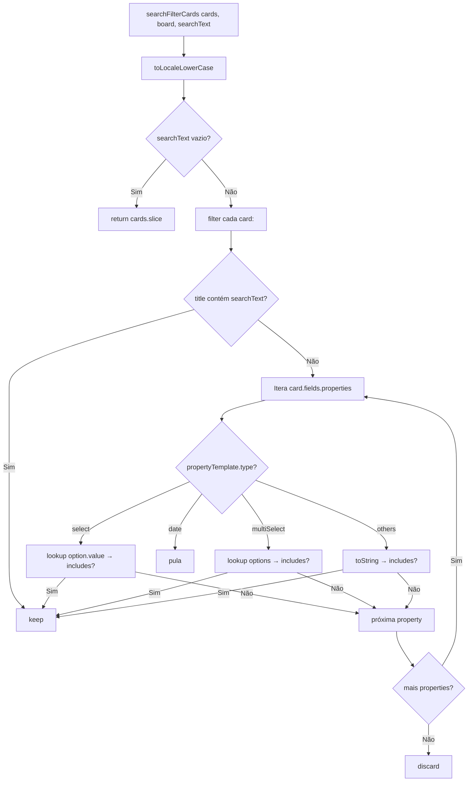
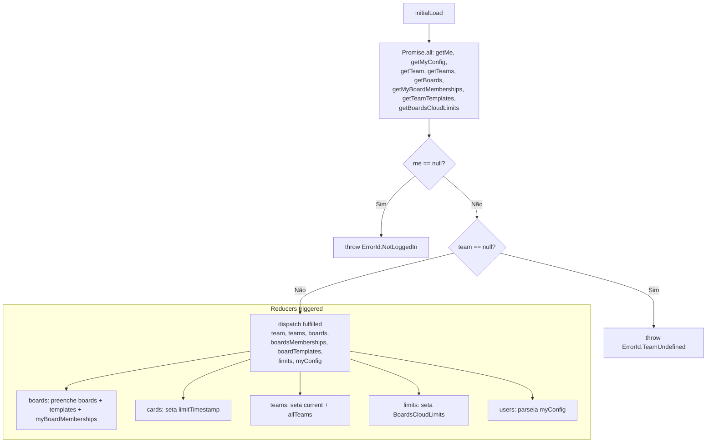

# Flowchart — Módulo `webapp/src/store`

> 🟢 CONFIRMADO | 🟡 INFERIDO | 🔴 LACUNA

---

## Fluxo de Card Sorting

```mermaid
flowchart TD
    A[sortCards] --> B{sortOptions.length > 0?}
    B -->|Não| C[Manual sort via cardOrder]
    C --> D[titleOrCreatedOrder fallback]

    B -->|Sim| E[Para cada sortOption:]

    E --> F{propertyId === __title?}
    F -->|Sim| G[titleOrCreatedOrder]

    F -->|Não| H[Busca template no board.cardProperties]
    H --> I{template encontrado?}
    I -->|Não| J[return cards, logError]

    I -->|Sim| K[Switch template.type]

    K -->|number / date| L[Empty no final, Number(a) - Number(b)]
    K -->|createdBy| M[usersById[a.createdBy].username]
    K -->|updatedBy| N[usersById[a.modifiedBy].username]
    K -->|createdTime| O[a.createAt - b.createAt]
    K -->|updatedTime| P[max(updateAt, lastComment) -> subtract]
    K -->|select / multiSelect| Q[lookup option.value pelo ID]
    K -->|multiPerson| R[map IDs → usernames → toString]
    K -->|others| S[aValue.localeCompare(bValue)]

    L --> T{result === 0?}
    M --> T
    N --> T
    O --> T
    P --> T
    Q --> T
    R --> T
    S --> T

    T -->|Sim| U[titleOrCreatedOrder desempate]
    T -->|Não| V[sortOption.reversed ? -result : result]
    U --> V
```

## Fluxo de Card Search/Filter



## Fluxo de Board Members Update

```mermaid
flowchart TD
    A[updateMembersHandler state, action] --> B{payload vazio?}
    B -->|Sim| C[return]
    B -->|Não| D[boardId = payload[0].boardId]
    D --> E[boardMembers = membersInBoards[boardId] || {}]

    E --> F[Para cada member:]
    F --> G{!schemeAdmin && !schemeEditor<br/>&& !schemeViewer && !schemeCommenter?}
    G -->|Sim| H[delete boardMembers[member.userId]]
    G -->|Não| I[boardMembers[member.userId] = member]

    I --> J[Verifica myBoardMemberships]
    H --> J
    J --> K{member.userId === myBoardMembership.userId?}
    K -->|Sim, sem permissões| L[delete myBoardMemberships[boardId]]
    K -->|Sim, com permissões| M[myBoardMemberships[boardId] = member]
    K -->|Não| N[próximo]
```

## Fluxo de Inicialização


