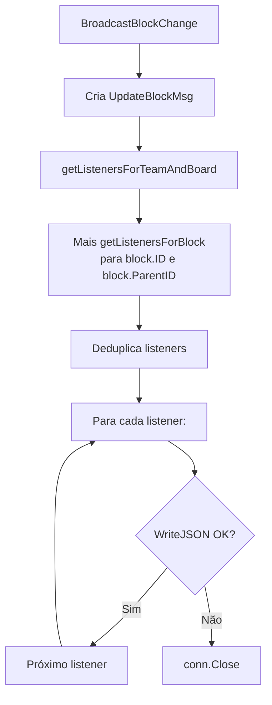
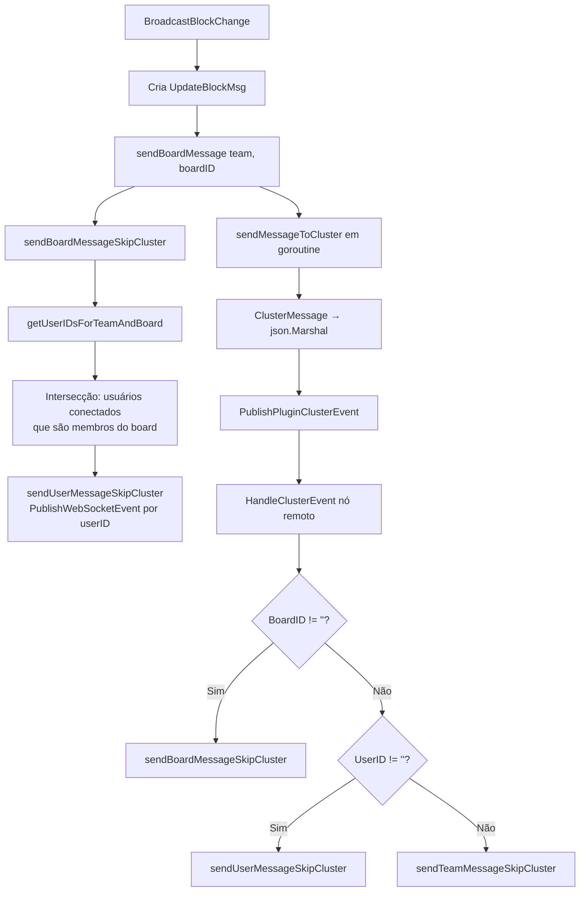
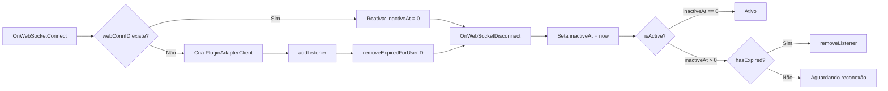
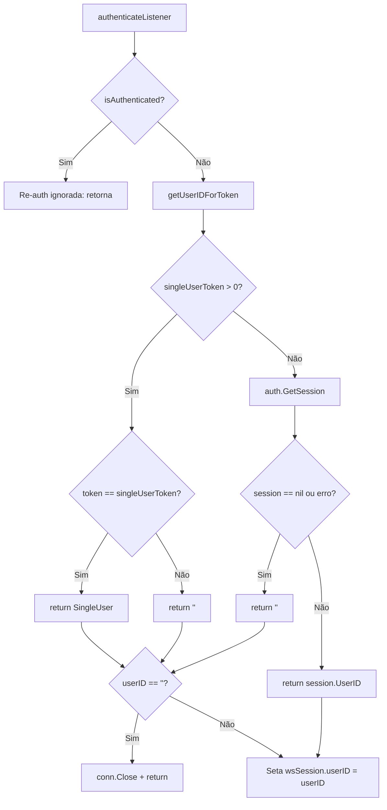

# Flowchart — Módulo `server/ws`

> 🟢 CONFIRMADO | 🟡 INFERIDO | 🔴 LACUNA

---

## Fluxo de Conexão WebSocket

```mermaid
flowchart TD
    A[HTTP Upgrade Request] --> B{Upgrade OK?}
    B -->|Sim| C[Cria websocketSession vazia<br/>userID='', teams=[], blocks=[]]
    B -->|Não| D[Log ERROR + return]
    
    C --> E{isMattermostAuth?}
    E -->|Sim| F[Seta userID = Header<br/>Mattermost-User-Id]
    E -->|Não| G[userID permanece vazio]
    
    F --> H[addListener → registra no<br/>mapa listeners]
    G --> H
    
    H --> I[defer: removeListener + conn.Close]
    I --> J[Mensagem loop]
    
    J --> K[ReadMessage]
    K --> L{Erro?}
    L -->|Sim| M[removeListener + break]
    L -->|Não| N[Unmarshal JSON]
    
    N --> O{Unmarshal erro?}
    O -->|Sim| P[Log ERROR JSON + continue]
    O -->|Não| Q{Ação == AUTH?}
    
    Q -->|Sim| R[authenticateListener]
    R --> J
    
    Q -->|Não| S{Ação == SUBSCRIBE_BLOCKS<br/>ou UNSUBSCRIBE_BLOCKS?}
    S -->|Sim| T{readToken válido?}
    T -->|Sim| U[subscribe/unsubscribe blocks]
    T -->|Não| V[Log ERROR + continue]
    U --> J
    V --> J
    
    S -->|Não| W{isAuthenticated?}
    W -->|Não| X[Log ERROR + continue]
    
    W -->|Sim| Y[Switch action]
    
    Y --> ZA[SUBSCRIBE_TEAM]
    Y --> ZB[UNSUBSCRIBE_TEAM]
    Y --> ZC[default: ERROR]
    
    ZA --> ZA1{SingleUser?}
    ZA1 -->|Sim, userID==SingleUser| ZA2[subscribeListenerToTeam]
    ZA1 -->|Sim, userID!=SingleUser| ZA3[continue]
    ZA1 -->|Não| ZA4{DoesUserHaveTeamAccess?}
    ZA4 -->|Sim| ZA2
    ZA4 -->|Não| ZA5[Log ERROR + continue]
    ZA2 --> J
    
    ZB --> ZB1[unsubscribeListenerFromTeam]
    ZB1 --> J
    ZC --> J
```

## Fluxo de Broadcast (Standalone Server)



## Fluxo de Broadcast (PluginAdapter)



## Ciclo de Vida do PluginAdapterClient



## Fluxo de Autenticação


