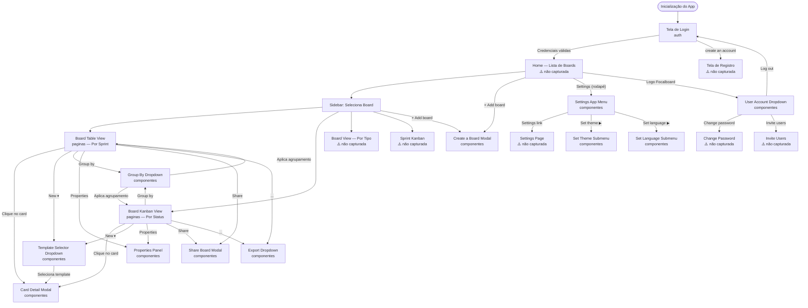
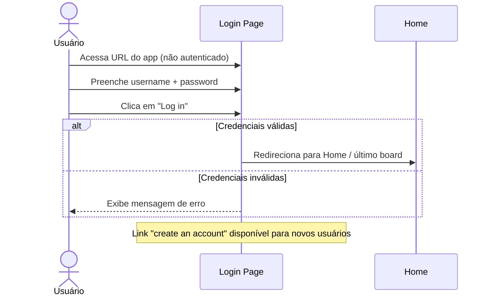
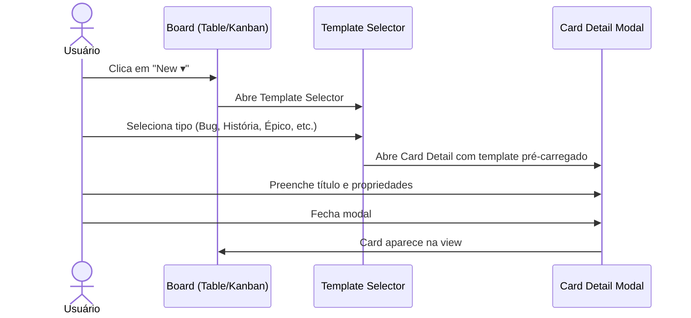
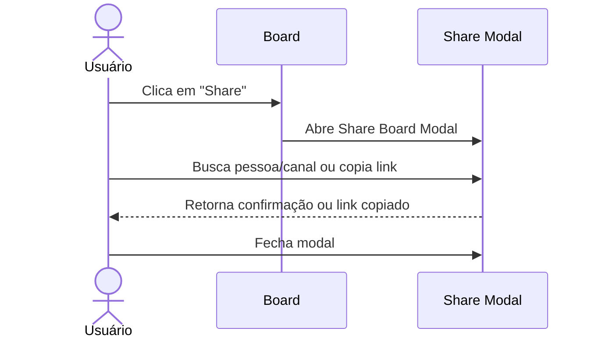
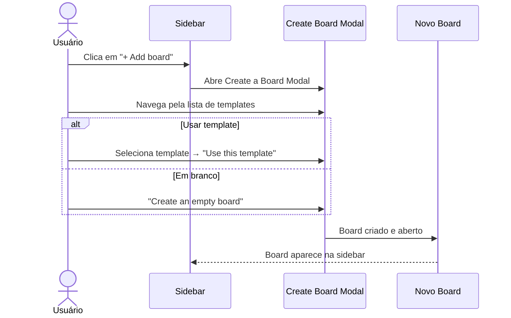

# UI Flow — Fluxo de Navegação

> Fluxo de navegação entre telas do Nexo (Focalboard), mapeado a partir das screenshots capturadas.
> Gerado por: reversa-visor — 2026-05-24

## Diagrama principal

## Fluxo: Autenticação (Login)

## Fluxo: Criar novo card

## Fluxo: Compartilhar board

## Fluxo: Criar novo board

## Pontos de entrada

| Ponto | Descrição |
|---|---|
| URL direta do board | `https://focalboard.fischerzanin.com.br/...` |
| Login → Home → Board | Fluxo padrão de primeiro acesso |
| Link "Share internally" | Acesso direto por link com permissão |

## Pontos de saída

| Ponto | Descrição |
|---|---|
| Settings Page | Configurações avançadas (idioma, tema, conta) |
| Exportação CSV/Archive | Download de dados — sai do contexto do board |
| "Give feedback" | Link externo para feedback ao time Focalboard |
